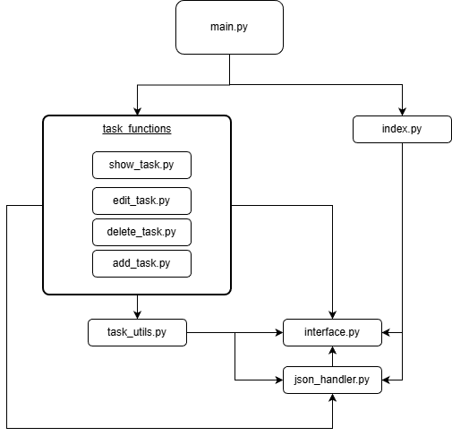
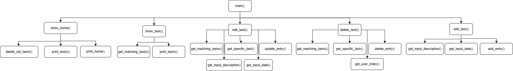

# 📝 Task Tracker


**Task Tracker** is a robust, console-based application designed to help students and professionals manage daily tasks efficiently. It focuses on clean architecture, strict data validation, and persistent storage using JSON.

---

## 📖 Table of Contents
- [Analysis & Context](#-analysis--context)
- [Key Features](#-key-features)
- [User Stories](#-user-stories)
- [Use Cases](#-use-cases)
- [Getting Started](#-getting-started)
- [Usage Guide](#-usage-guide)
- [Architecture & Design](#-architecture--design)
- [Project Requirements](#-project-requirements)
- [Team & Acknowledgments](#-team--acknowledgments)

---

## 🧐 Analysis & Context

### The Problem
Users often struggle to manage daily tasks-such as homework, assignments, and personal to-do's-because existing tools are polarized: they are either too complex with overwhelming features or too simple, lacking data persistence.

### Our Solution
**Task Tracker** offers a minimalist, reliable middle ground. It launches immediately into a dashboard of your most urgent tasks and ensures data integrity by validating all inputs. All changes are saved automatically to a local JSON file (`task_data.json`), ensuring data persists even after restarting the system.

---

## 🚀 Key Features

* **⚡ Instant Dashboard:** Immediately displays the top 3 upcoming tasks upon launch.
* **🧹 Auto-Cleanup Algorithm:** A silent startup check automatically deletes tasks strictly older than "today" to keep your list fresh.
* **💾 Persistence:** All data is stored in `task_data.json`, ensuring no data loss.
* **🔍 Smart Search:** Filter tasks by **Date** or **Description** keyword.
* **🛡️ Robust Validation:**
    * Prevents entering past dates.
    * Rejects empty descriptions.
    * Enforces `yyyy.mm.dd` format.
    * Handles corrupted files gracefully without crashing.

---

## 👤 User Stories

1.  **As a user**, I want to see a **dashboard of the next 3 tasks** immediately upon opening the app for a quick status update.
2.  **As a user**, I want to **add a new task** with a valid future date and description to keep my schedule accurate.
3.  **As a user**, I want to **search for a task** by date or description so I can efficiently plan my activities.
4.  **As a user**, I want to **edit specific tasks** to update their details as my plans change.
5.  **As a user**, I want to **delete completed or outdated tasks** to keep my workload focused.
6.  **As a user**, I want outdated tasks to be **automatically deleted** to keep my view clutter-free.
7.  **As a user**, I want the option to **cancel an action** (by typing '1') if I change my mind during input.
8.  **As a user**, I want my data **automatically saved** so I never lose my progress.

---

## ⚙️ Use Cases

### UC1: Launch & Auto-Cleanup
* **Trigger:** User runs `main.py`.
* **System Action:** Loads data, removes tasks older than `today`, sorts remaining tasks, and displays the **Main Menu** + **Top 3 Upcoming Tasks**.

### UC2: Add Task
* **Trigger:** User selects Option `2`.
* **Flow:** System prompts for date (`yyyy.mm.dd`) and description.
* **Validation:** Checks format and ensures date $\ge$ today. Confirms success upon saving.

### UC3: Search & View
* **Trigger:** User selects Option `1`.
* **Flow:** User chooses search mode (`0` for Description, `1` for Date) and enters query. System displays all matching results.

### UC4: Edit Task
* **Trigger:** User selects Option `3`.
* **Flow:** User searches for a task, selects it by ID, and provides new validated details. System overwrites the entry.

### UC5: Delete Task
* **Trigger:** User selects Option `4`.
* **Flow:** User finds a task, selects it, and confirms deletion. System permanently removes the entry.

---

## 💻 Getting Started

### Prerequisites
* Python 3.10 or higher (Developed on Python 3.12).
* **Git** (for cloning the repository).
* **No external packages required** (Uses standard libraries only: `json`, `datetime`, `sys`).

### Installation

1.  **Clone the repository**:
    ```bash
    git clone https://github.com/JuanFHNW/task_tracker.git
    cd task-tracker
    ```

2.  **Run the application**:
    ```bash
    python main.py
    ```

---

## 🕹️ Usage Guide

**Main Menu Interface:**
```text
Your upcoming tasks: 
2025-12-17: Programming presentation
2025-12-21: Submission essay

==== TASK PLANNER MENU ====
1. Show your tasks
2. Add task
3. Edit task
4. Delete task
5. Exit
==========================
```
## 💡 Pro Tips
* **Navigation:** Enter the number corresponding to the menu option (`1`-`5`).
* **Canceling:** Type `1` during any data entry prompt (like entering a date) to cancel the operation and return to the main menu.
* **Date Format:** Always use `yyyy.mm.dd` (e.g., `2025.12.25`).

---

## 🏗️ Architecture & Design
We followed the **Separation of Concerns** principle and the **IPO (Input-Process-Output)** model to ensure maintainability and clarity.

### File Structure
```text
TaskTracker/
│
├── main.py                  # Entry Point
├── index.py                 # Dashboard & Cleanup Logic
├── interface.py             # User Interface (Input/Output)
├── json_handler.py          # Data Persistence (JSON)
├── task_data.json           # Database
│
└── task_functions/          # Feature Modules
    ├── add_task.py
    ├── edit_task.py
    ├── delete_task.py
    └── show_task.py
```

### Visual Architecture
Below are the high-level diagrams illustrating our module dependencies and the function call hierarchy.

**Module Dependencies:**




**Function Call Tree:**

*Note: Due to the focus on clear and modular design, this diagram only includes the essential functions and omits low-level utility calls (like `print_msg` or `wait_for_user`).*



### Execution Flow Sketches
These timelines visualize exactly *when* each part of the code runs during key operations.

**1. App Launch & Cleanup**
> `Start (main.py)` → `index.show_home()` → `delete_old_tasks()` → `Sort & Print Dashboard` → `Wait for User Input`

**2. Adding a Task**
> `User Selects "2"` → `add_task.py` → `get_input_date()` → `get_input_description()` → `json_handler.add_entries()` → **Save to JSON** → `End`

**3. Searching & Editing**
> `User Selects "3"` → `edit_task.py` → `Search (Date/Desc)` → `Select Task ID` → `Enter New Data` → `update_entry()` → **Overwrite JSON** → `End`

## ✅ Project Requirements
This project fulfills the criteria for the **Programming Foundations** module:

- [x] **Interactive App:** Console-based menu with dynamic user interaction.
- [x] **Data Validation:** Strict input checking (dates, empty strings, types) using `try-except` blocks.
- [x] **File Processing:** Reads and writes structured JSON data (`task_data.json`) with error handling for file existence and corruption.

---

## 👥 Team & Acknowledgments

**Development Team:**
* **Bernardo Alfonso Suárez Espinoza** (Index function + Testing)
* **Juan Vock** (Edit function + Add function + Architecture)
* **Fernando Mauracher Garcia** (Delete function + Show function)


**Date:**
* 17th December 2025

---

### 📝 License
This project is provided for educational use only as part of the FHNW Programming Foundations module.
[MIT License](LICENSE)
